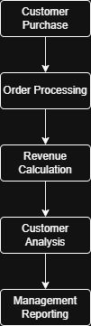

## Business Insights

- Identified highest values customer based on lifetime spending.
- Detected customers at risk of churn due to inactivity.
- Segmented customers by value to support targeted retention strategy.
- Analyzed monthly revenue trends and growth patterns.

# Customer Analytics using SQL

## Project Overview
his project analyzes customer behavior, spending patterns, and revenue trends using SQL to support business decision-making.

## Key Analysis
- Customer Lifetime Value
- Customer Segmentation
- Churn Detection
- Revenue Trends
- Customer Ranking

## Tools
- PostgreSQL
- SQL

## User Acceptance Testing (UAT)
To ensure accuracy and reliability of analysis results, basic UAT-style testing was performed.

### Test Activities
- Verified revenue and profit calculations using tes queries.
- Validated customer segmentation logic against expected business rules.
- Tested churn detection conditions.
- Identified and corrected aggregation errors during development.

## Process Workflow
This diagram illustrates the flow of customer data from purchase to reporting, helping identify business processes and analysis points.
